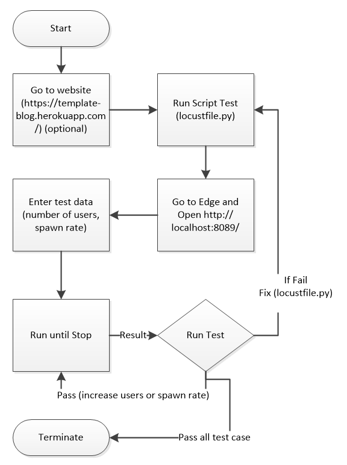
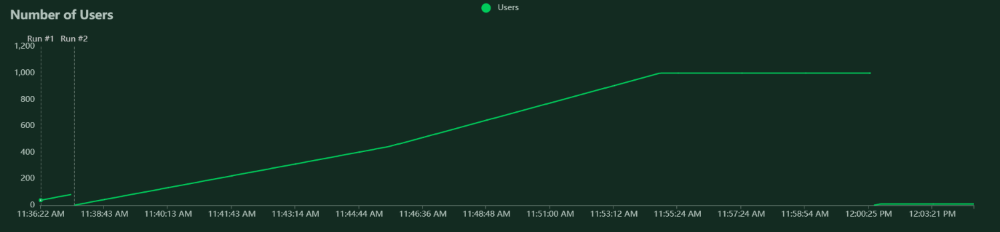
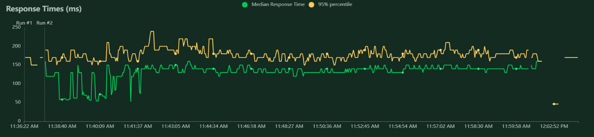
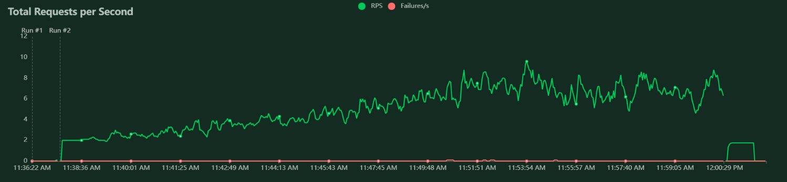

# Performance Testing roles in Software Testing, Approach, Use Case, and Automated Performance Testing

**Abstract** - An Introduction to Performance Testing. An approach to performance testing is discussed. A case study using 
locustio to perform performance testing on a blog website is presented

**Index Terms** - Software performance testing, performance testing, software testing.

## 1. Introduction:

### a. Performance Testing Definition:

Performance testing is a testing technique, performed to determine the responsiveness and stability of 
a software system under various workload.
Performance testing metrics are scalability, reliability, resource usage. 
There are four primary type of performance testing: Load Testing, Stress Testing, Soak Testing, and Spike Testing. 
Performance testing is a non-functional testing [3].

### b. System Performance Degradation:

According to [1], system performance degradation or problems handling required system
throughput is an extremely significant issue for many large industrial projects. Although the software system has gone through
extensive functionality testing, it was never really tested to assess its expected performance [1].

During an architecture review at AT&T, a group of engineer have found that "performance issues
account for one of the three major fault categories. Performance problems identified might include
such things as the lack of performance estimates, the failure to have proposed plans for data collection, 
or the lack of a performance budget". They also claimed that insufficient planning for performance issues
is the major issues when the software deploy to the field [1].

Major issues are issues that will impact on user satisfaction.

### c. Uneven Distribution of Resource Usage:

Pareto-type distribution is also known as very uneven distribution of resource usage. The main reason for system performance degradation
is claimed distribution of project-affecting issues (Pareto-type distribution). According to [1], it was found that 70 percent of the most severe class of problems 
resided in the weakest 30 percent of the project.

## 2. Previous Work:

According to [1], The author doesn't find any adequate of performance testing knowledge on the Internet. He found out that "there is neither an
existing body of research literature nor an extensive collection of practical or experiential information available
to help testers faced with the prospect of doing software performance testing".

## 3. Performance Testing Tools:
### a. Locust IO:

Locust is an easy to use, scriptable and scalable performance testing tool. 
Instead of being constrained by a UI or domain specific language, Locust infinitely expandable and very developer friendly due to its code base tools.
Locust IO is required Python programming knowledge, and it is easy to use and develop test case.

**Write user test scenarios in Python code:**
If tester want the users to loop, perform some conditional behaviour or do some calculations. Locust runs every user inside its own greenlet (a lightweight process/coroutine)
which enables tester to write your tests like normal Python code (instead of using callbacks or other methods).
Tester can use any Python IDE, and version control tester's test script as regular code (as opposed to some other tools that use XML or binary formats)

**Distributed & Scalable - supports hundreds of thousands of users:**
Locust makes it easy to run load tests distributed over multiple machines. It is event-based which makes it possible for a single process to handle many thousands concurrent users.

**Locust Features:**
Running in Docker, distributed load generation, running test in a debugger, running Locust distributed with Terraform/AWS, running Locus automation
, retrieved test statistics in CSV format, testing non-HTTP systems, testing request base SDKs, increase performance with a faster HTTP client, event hooks,
logging, using locust as a library.

### b. Expertus:

Retrieved from [4], Expertus is designed to automate large scale distributed experiment studies in IaaS clouds with the goal of addressing three challenges:

**Experiment challenges:**
Performance testing for enterprise applications consists of multiple closely related scenarios by
varying a few configurable (preferably one) parameters at a time. 

**Application challenges:**
In distributed software testing the applications should start efficiently and in a provably correct order by simultaneously 
enforcing serialization constraints and leveraging the distributed system’s inherent parallelism.

**Cloud challenges:**
Selecting the most appropriate cloud from many cloud offerings is a non-trivial task. Also, migrating an application between
two clouds is a complex, time-consuming and error-prone task. Finally, communication, coordination, synchronization, monitoring and complete management challenges; lastly, the dynamic
nature of the cloud introduces extra complexity

## 4. Use Case: Testing Website (Blog) using Locust IO:

In this experiment, I will also perform performance testings (automated test) on a working websites that was designed by Dr. Angela Yu, and implement by myself.

### a. Requirement Analyst:
Application name is Blog-Template, and it was designed using Flask Framework, and Jinja Template (Python). It's also using PostgreSQl for database.
The database schema is used primary to store blog contents and user information.
This website is fully functional and extendable. Code review was conduct by Truc Huynh. Technologies which are implemented in the application: 
Flask framework, Jinja template, Object-Oriented Programming, SQL Alchemy, Password Hashing (werkzeug.security), Bootstrap, CK Editor (user input),
HTML, CSS, JavaScript...

Blog-Template was original designed by Dr. Angela Yu and implemented by Truc Huynh. 
Application is a blog template that allow registered user to edit or comment on a post. 
Only the admin can create , edit or delete post. Application was host at heroku.com, and the hyperlink is "https://template-blog.herokuapp.com/".

The Blog-Template was designed as a template blog and post on GitHub by Truc Huynh ("https://github.com/jackyhuynh/blog-template").
Anyone can use the blog for any purpose. The first user will be automatically set as the admin.

### b. Structure of Backend:
**main.py** is the python script that contain all component that required to run the application (Blog Template).
The "main.py" consists all required package (Python library) and the route for the front-end. The front-end was built with
HTML, CSS, and Bootstrap, and store in templates folder (about.html, contact.html, footer.html, header.html, index.html, 
login.html, make-post.html, post.html, register.html). The static folder contain all the .css files, images, javascript.

The package(folders contain main.py and all the necessary file) then push through GitHub and deploy to Heroku from GitHub.
Therefore, every time I make change, application will automatically change. I also schedule automatic testings (mostly functional testing and GUI testing)
for the app everytime I make change (just to make sure nothing will break when I make a new commit). 

PyCharm IDE was used to develop this code but user can use any IDE to navigate the code.
```python
from flask import Flask, render_template, redirect, url_for, flash, abort
from flask_bootstrap import Bootstrap
from flask_ckeditor import CKEditor
from datetime import date
from functools import wraps
from werkzeug.security import generate_password_hash, check_password_hash
from flask_sqlalchemy import SQLAlchemy
from sqlalchemy.orm import relationship
from flask_login import UserMixin, login_user, LoginManager, login_required, current_user, logout_user
from forms import LoginForm, RegisterForm, CreatePostForm, CommentForm
from flask_gravatar import Gravatar
import os

app = Flask(__name__)
app.config['SECRET_KEY'] = os.environ.get("SECRET_KEY")
ckeditor = CKEditor(app)
Bootstrap(app)
gravatar = Gravatar(app, size=100, rating='g', default='retro', force_default=False, force_lower=False, use_ssl=False, base_url=None)

##CONNECT TO DB
app.config['SQLALCHEMY_DATABASE_URI'] = os.environ.get("DATABASE_URL", "sqlite:///blog.db")
app.config['SQLALCHEMY_TRACK_MODIFICATIONS'] = False
db = SQLAlchemy(app)
login_manager = LoginManager()
login_manager.init_app(app)


@login_manager.user_loader
def load_user(user_id):
    return User.query.get(int(user_id))


##CONFIGURE TABLE
class User(UserMixin, db.Model):
    __tablename__ = "users"
    # Create a User

class BlogPost(db.Model):
    __tablename__ = "blog_posts"
    # Create a BlogPost


class Comment(db.Model):
    __tablename__ = "comments"
    # Create a comment
db.create_all()


def admin_only(f):
    @wraps(f)
    def decorated_function(*args, **kwargs):
        if current_user.id != 1:
            return abort(403)
        return f(*args, **kwargs)
    return decorated_function


@app.route('/')
def get_all_posts():
    posts = BlogPost.query.all()
    return render_template("index.html", all_posts=posts, current_user=current_user)


@app.route('/register', methods=["GET", "POST"])
def register():
    form = RegisterForm()
    # ... Code to Register ...


@app.route('/login', methods=["GET", "POST"])
def login():
    form = LoginForm()
    # ... Code to Login ...


@app.route('/logout')
def logout():
    logout_user()
    # ... Code to Logout ... 


@app.route("/post/<int:post_id>", methods=["GET", "POST"])
def show_post(post_id):
    form = CommentForm()
    # ... Code to show post ...


@app.route("/about")
def about():
    return render_template("about.html", current_user=current_user)


@app.route("/contact")
def contact():
    return render_template("contact.html", current_user=current_user)


@app.route("/new-post", methods=["GET", "POST"])
@admin_only
def add_new_post():
    form = CreatePostForm()
    # ... Code to add new post ...


@app.route("/edit-post/<int:post_id>", methods=["GET", "POST"])
@admin_only
def edit_post(post_id):
    post = BlogPost.query.get(post_id)
    # ... Code to edit post ...

@app.route("/delete/<int:post_id>")
@admin_only
def delete_post(post_id):
    post_to_delete = BlogPost.query.get(post_id)
    # ... Code to delete post ...


if __name__ == "__main__":
    app.run(debug=True)
```

### c. Test Plan Design:


**Test plan:** After analyzing Blog-Template Source Code and requirements, I design my test plan.
My plan is simple increase the number of users over time and stop at 3 millions users. 
I will only perform 3 tasks on the websites: login, visit contact page, and visit post number 1. 
Even though, Locust IO allow me with much more tests such as create a tasks, edit, or delete it; create new users; import new
documentation into user post... However, I just want to keep my tasks simple for this use case.

I will run automated test start at 1000 users at a spawn 1.00 second then I will increase by 1000 for each test case.
There are 2 script that I need to design: the performance test script and the schedule test script.


### d. Test Suite Implementation:

**Plan:**
Run the test script (or use another script to schedule the test script). The schedule script should be able to increase the amount of user
after each successful test. The process is described below



**Test Script:**
Set the wait time for each user from 1 to 300 second so that each user will be able to navigate and read 1 post or do some comment.
Task number 1 is to navigate to contact page (and stay there for 40 second). After 50 second navigate to the post 1. 
PyCharm IDE is used to run the code.

This is the content of the test script (locust_test.py)
```python
from locust import HttpUser, task, between


class TestCases(HttpUser):
    host = "https://template-blog.herokuapp.com/"
    # Set the wait time for each user from 1 to 300 second
    # So that each user will be able to navigate and read 1 post or do some comment
    wait_time = between(1, 300)
    
    # When user in login the user
    def on_start(self):
        self.client.post("/login", json={"Email": "jackyhuynh87@gmail.com", "Password":"1234"})

    # task number 1 is to navigate to contact page (and stay there for 40 second)
    @task(10)
    def visit_contact(self):
        self.client.get("/contact")

    # after 50 second navigate to the post 1
    @task(50)
    def visit_post_1(self):
        self.client.get("/post/1")
```

**Execute:**

Run this script within the Terminal of PyCharm IDE
```bash
locust -f locust_test.py
```
Then go to "http://localhost:8089/" for monitoring. This is how it looks like


**Automation Testing:**

For automation testing without the WEB UI, run this script below instead. 
```bash
locust -f locust_test.py -u 1000 -r 100 --run-time 1h30m --stop-timeout 99
```
To schedule a full test suite, we need to write another Python script that increment the users as our test plan and simple schedule it.
Depend on the application report on peak time (e.g. 2 millions people operate at the same time). Tester can simply set the user to that peak,
and schedule the performance test when they have a change in the system (or just for regular maintainable).

Something like this
```bash
python3 schedule-script.py
```
Schedule script(schedule-script.py) can be used to scan and detect change in code, then run performance test if needed.

### e. Result

Result for the first test case 1000 user at 1.00 spawn rate. The result return with 0% fail rate. 
Testers can download the PDF, CVS version for data analysis. Web UI can also be use for monitoring with real time monitoring and interactive chart.

In my latest test, Template-Blog was able to handle 20,000 users at 0.5 spawn rate.

**Test Result**
This is printed within my IDE (Py Charm).
```bash
2022-03-10T17:00:41Z
[2022-03-10 12:00:41,483] DESKTOP-J4K30PB/INFO/locust.main: Shutting down (exit code 1)
 Name                                                                              # reqs      # fails  |     Avg     Min     Max  Median  |   req/s failures/s
----------------------------------------------------------------------------------------------------------------------------------------------------------------
 GET //contact                                                                       1095     1(0.09%)  |     120      27   19214     130  |    0.81    0.00
 POST //login                                                                        1000     0(0.00%)  |     144     114    1134     140  |    0.74    0.00
 GET //post/1                                                                        5162     4(0.08%)  |     125      28   25672     140  |    3.83    0.00
----------------------------------------------------------------------------------------------------------------------------------------------------------------
----------------------------------------------------------------------------------------------------------------------------------------------------------------
 2                  GET //post/1: ConnectionResetError(10054, 'An existing connection was forcibly closed by the remote host', None, 10054, None)
 2                  GET //post/1: RemoteDisconnected('Remote end closed connection without response')
 1                  GET //contact: ConnectionResetError(10054, 'An existing connection was forcibly closed by the remote host', None, 10054, None)
----------------------------------------------------------------------------------------------------------------------------------------------------------------
 Name                                                                              # reqs      # fails  |     Avg     Min     Max  Median  |   req/s failures/s
----------------------------------------------------------------------------------------------------------------------------------------------------------------
 GET //contact                                                                          1     0(0.00%)  |      42      42      42      42  |    0.01    0.00
 POST //login                                                                          10     0(0.00%)  |     162     137     181     160  |    0.05    0.00
 GET //post/1                                                                          18     0(0.00%)  |     106      40     194      66  |    0.09    0.00
----------------------------------------------------------------------------------------------------------------------------------------------------------------
 Aggregated                                                                            29     0(0.00%)  |     123      40     194     150  |    0.15    0.00

Response time percentiles (approximated)
 Type     Name                                                                                  50%    66%    75%    80%    90%    95%    98%    99%  99.9% 99.99%   100% # reqs
--------|--------------------------------------------------------------------------------|---------|------|------|------|------|------|------|------|------|------|------|------|
 GET      //contact                                                                              42     42     42     42     42     42     42     42     42     42     42      1
 POST     //login                                                                               170    170    170    170    180    180    180    180    180    180    180     10
 GET      //post/1                                                                               69    170    170    170    180    190    190    190    190    190    190     18
--------|--------------------------------------------------------------------------------|---------|------|------|------|------|------|------|------|------|------|------|------|
 None     Aggregated                                                                            150    170    170    170    180    180    190    190    190    190    190     29
```

**Number of User Chart**
This is the WEB UI chart (1000 user at 1.00 spawn rate)


**Number of Response Time**
This is the WEB UI chart (1000 user at 1.00 spawn rate)


**Total Request per Second**
This is the WEB UI chart (1000 user at 1.00 spawn rate)


## C. Advantages/Disadvantage of Locust
### Advantage:
Verifies the speed, accuracy, and stability of the software match expectation. Assists the system by authenticating the responsiveness and managing the scalability and reliability of software features.
It is free and open sources. 

### Disadvantage:
Locust can be a costly mistake if done haphazardly, leading to inaccurate results and conclusions. Need Python programming 
knowledge to perform the test (must be very fimilar with Python to design complicated test case)

## E. Reference:

E. J. Weyuker and F. I. Vokolos, "Experience with performance testing of software systems: issues, an approach, and case study," in IEEE Transactions on Software Engineering, vol. 26, no. 12, pp. 1147-1156, Dec. 2000, doi: 10.1109/32.888628. [1]

D. Jayasinghe et al., "Expertus: A Generator Approach to Automate Performance Testing in IaaS Clouds," 2012 IEEE Fifth International Conference on Cloud Computing, 2012, pp. 115-122, doi: 10.1109/CLOUD.2012.98. [4]

Kumar. K., "Write your first performance/load test in Python.", Retrieved from https://medium.com/@kundan3034/write-your-first-performance-load-test-in-python-e8e2132ef775 [2]

Tutorial Points (n.d.), "Performance Testing", Retrieved from https://www.tutorialspoint.com/software_testing_dictionary/performance_testing.htm [3]
 
Bystron. C.,  Heyman. J., Hamren J., Heyman. H. and Holmberg. L., Locust, Retrieved from https://github.com/locustio/locust [5]

Retrieved from http://docs.locust.io/en/stable/running-without-web-ui.html# [6]